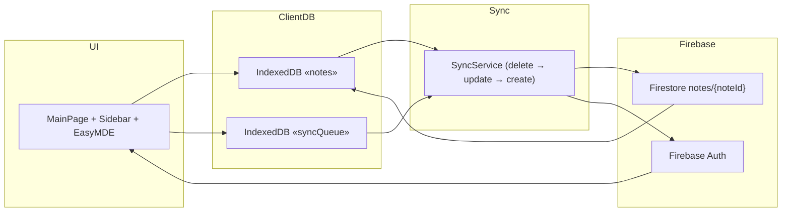
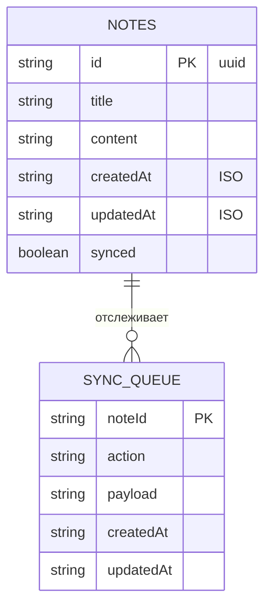

# Notes App

Современное offline-first React-приложение с Markdown-редактором, умной очередью синхронизации и PWA-функциями. Всё, что создаётся в UI, сохраняется в Dexie, попадает в очередь, а затем доставляется в Firebase с приоритетом операций.

## Содержание

- [Обзор](#обзор)
- [Live версия и тестовый пользователь](#live-версия-и-тестовый-пользователь)
- [Ключевые возможности](#ключевые-возможности)
- [Архитектура и диаграммы](#архитектура-и-диаграммы)
- [Технологии и почему](#технологии-и-почему)
- [Быстрый старт](#быстрый-старт)
- [Настройка Firebase](#настройка-firebase)

## Обзор

**Что:** Notes App — это Markdown-редактор для заметок, который работает оффлайн, доставляет всем изменениям высокую степень надёжности и синхронизацию через Firebase.

**Почему:** В приложении сочетаются Dexie/IndexedDB, виртуализация списков, очередь SyncService и Firebase Auth, чтобы показать архитектуру на примере реального продуктового фронтенда.

## Live версия и тестовый пользователь

[](https://notes-app-97c86.web.app/)

| Поле   | Значение        |
| ------ | --------------- |
| Email  | `test@test.com` |
| Пароль | `qwerty123`     |

## Ключевые возможности

### 📝 Редактирование

- EasyMDE + react-markdown дают live-превью, подсветку и поддержку GitHub Flavored Markdown.
- Автосохранение (≈2 секунды) и локальная история предотвращают потерю данных без сети.
- Ленивая загрузка редактора держит первый экран лёгким.

### 🔍 Поиск и навигация

- Полнотекстовый поиск с debouncing 300 ms и клавиатурные шорткаты (стрелки/Enter/Delete).
- React Window виртуализирует список, чтобы можно было быстро просматривать тысячи заметок.
- Sidebar, Add Note, Search и NoteItem — отдельные компоненты, которые легко тестировать.

### ☁️ Синхронизация и оффлайн

- `syncQueue` хранит записи с приоритетом delete → update → create, SyncService отправляет их партиями.
- Retry и exponential backoff обеспечивают устойчивость к разрывам сети.
- Конфликт-резолюция основана на `updatedAt` и `timestamp` из Firebase.

### 🎨 UI и доступность

- Mantine UI + тема light/dark + adaptive spacing сохраняют единый визуальный стиль.
- Error boundary и notifications показывают ошибки без сбоев UI.
- ARIA-атрибуты, фокус и клавиатурные юзабилити-хаки уже в компонентах.

### 🔐 Auth и защита

- Firebase Auth + ProtectedRoute + persistent token guard.
- Все запросы идут через Firebase SDK, благодаря чему не нужно вручную управлять токенами.

### 💾 Локальное хранилище

- Dexie хранит `notes`, `syncQueue`, `metadata`.
- Индексы по `updatedAt`, `createdAt`, `synced` обеспечивают быстрое чтение.
- Очередь синхронизации дублирует `noteId` и `payload`, чтобы повторно отправить операции.

## Архитектура и диаграммы

### Диаграмма потока данных



### Хранилище



### Очередь синхронизации

`syncService.ensurePendingQueue()` собирает текущие записи, проверяет отсутствие дубликатов и передаёт их в `firebaseService.syncNoteRecord`, чтобы очередь гарантированно доставлялась в Firebase.

## Технологии и почему

| Область       | Стек                                                | Обоснование                                              |
| ------------- | --------------------------------------------------- | -------------------------------------------------------- |
| UI            | React 19 + Mantine + React Router 7 + React Window  | Concurrent mode, theming и виртуализация большого списка |
| Markdown      | EasyMDE + react-markdown + remark-gfm               | Live-просмотр и GFM                                      |
| Хранилище     | Dexie (IndexedDB)                                   | Offline-first, индексы, реактивные запросы               |
| Синхронизация | SyncService + Firebase SDK                          | Очередь delete→update→create, retry и timestamps         |
| Auth          | Firebase Auth + ProtectedRoute                      | Безопасный доступ и persistent tokens                    |
| QA/Deploy     | Vite + ESLint + Prettier + Husky + Firebase Hosting | Быстрый dev experience, линтинг, CI и хостинг            |

## Быстрый старт

### Предварительные требования

- Node.js 18+
- npm или yarn
- Firebase проект (Firestore + Auth)

### Установка

```bash
git clone https://github.com/Evermishka/notes-app.git
cd notes-app
npm install
cp firebase-config-example.txt .env
# вставьте реальные значения
npm run dev
```

### Продакшен

```bash
npm run build
npm run preview
```

### Проверка качества

```bash
npm run lint
npm run format
```

## Настройка Firebase

1. Откройте Firebase Console и создайте проект (или используйте существующий).
2. Добавьте Web-приложение, скопируйте конфиг (Project Settings → Your apps).
3. Включите Firestore (режим restricted) и Firebase Auth (Email + Password).
4. Скопируйте значения в `.env`, например:

```
VITE_FIREBASE_API_KEY=your_api_key_here
VITE_FIREBASE_AUTH_DOMAIN=your_project.firebaseapp.com
VITE_FIREBASE_PROJECT_ID=your_project_id
VITE_FIREBASE_STORAGE_BUCKET=your_project.appspot.com
VITE_FIREBASE_MESSAGING_SENDER_ID=123456789
VITE_FIREBASE_APP_ID=1:123456789:web:abcdef123456
```

5. Примените правила из `firestore.rules`, чтобы запрещать неавторизованный доступ.
